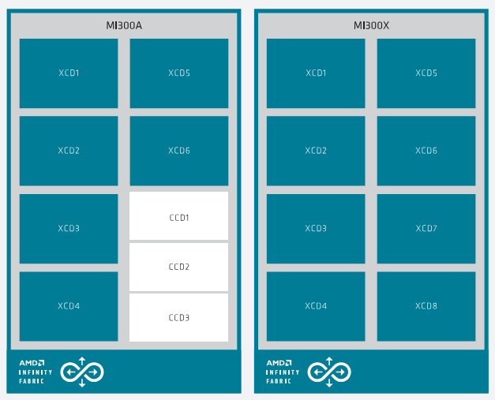
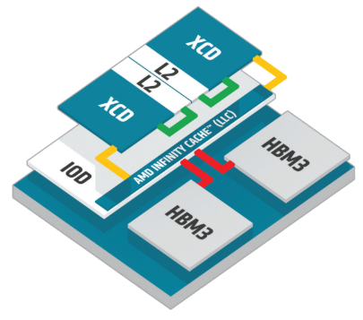
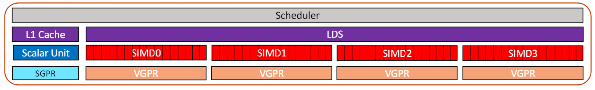

# AMDGPU Kernel Optimization Guide

Author: Jakub Kuderski @kuhar

Date: 2024-06-24

Last Update: 2024-06-25

## Introduction

We present a summary of the AMDGPU (micro-)architecture that we found necessary
to understand and account for in [IREE](https://iree.dev) and [Turbine
Kernels](https://github.com/iree-org/iree-turbine) in order to produce
performant kernel code. The information presented strives to be sufficiently
close to reality to be useful in kernel code generation, but **is not**
guaranteed to be 100% correct and accurate.

In addition, this document interleaves actionable optimization tips that we
derived from our understanding of the architecture.

> [!NOTE]
> This is not a reference manual or an official AMDGPU architecture guide.

### Resources

For official documentation, see:
* [MI300 ISA
  Manual](https://www.amd.com/content/dam/amd/en/documents/instinct-tech-docs/instruction-set-architectures/amd-instinct-mi300-cdna3-instruction-set-architecture.pdf)
* [CDNA3
  Whitepaper](https://www.amd.com/content/dam/amd/en/documents/instinct-tech-docs/white-papers/amd-cdna-3-white-paper.pdf)
* [ROCm Optimization Guide for LLM
  Inference](https://rocm.docs.amd.com/en/latest/how-to/llm-fine-tuning-optimization/index.html)

For third-party documentation, see:
* [Introduction to
  AMDGPU](https://www.olcf.ornl.gov/wp-content/uploads/2019/10/ORNL_Application_Readiness_Workshop-AMD_GPU_Basics.pdf)
  from the Oak Ridge National Lab
* [CDNA3 Compute Architecture
  Overview](https://chipsandcheese.com/2023/12/17/amds-cdna-3-compute-architecture/)
  from Chips and Cheese
* [MI300X Benchmarks](https://chipsandcheese.com/2024/06/25/testing-amds-giant-mi300x/) (bandwidth, latency, speed-of-light numbers) from Chips and Cheese

## Glossary

GPU programming uses naming specific to compute and graphics APIs, and is often
vendor specific. The table below juxtaposes the few most common ones:

| Vulkan | CUDA | AMDGPU | *Executes On* |
| --- | --- | --- | --- |
| Invocation / Thread | Thread | Thread | SIMD Lane |
| Subgroup | Warp | Wave(front) | SIMD |
| Workgroup | (Thread) Block | (Thread) Block / Workgroup | Compute Unit |
| N/A | (Thread) Block Cluster | N/A | Shader Engine |
| (Work)group counts | Grid | Grid | GPU |
| Workgroup Memory | Shared Memory | Local Data Store | LDS & Crossbar (Compute Unit) |

The rest of the document uses the Vulkan and AMDGPU naming for consistency.

## GFX9 Architecture Overview

The GFX9 line of hardware covers both consumer Radeon GPUs (GCN) and newer
datacenter MI accelerators like MI300 (CDNA3).

### MI300X Compute Topology

The MI300 GPU uses a chiplet design. For example, the MI300X variant consists
of 8 chiplets called XCDs, sat on 4 pairs of AIDs/IODs. One XCD contains 4
Shader Engines with the total of 38 Compute Units (CUs). One CU contains 4
16-lane-wide SIMDs. In total, MI300X has 304 CUs.

> [!TIP]
> The number of workgroups launched should be a multiple of the number of CUs to
> continuously utilize the whole GPU.

A kernel is dispatched to one or more CUs.





> Source: [The CDNA3
> Whitepaper](https://www.amd.com/content/dam/amd/en/documents/instinct-tech-docs/white-papers/amd-cdna-3-white-paper.pdf)

Each XCD has its own L2 cache and is connected to LLC cache (a.k.a. MALL:
memory-attached last-level, a.k.a 'Infinity Cache') via its IOD.

### MI300X Cache Hierarchy

There are 3 levels of cache:

| Name | Size | Cache Line Size | Associativity | Execution Unit | Comments |
| --- | --- | --- | --- | --- | --- |
| L1D | 32 kB | 128 B | 64-way, 4 sets | Compute Unit | Write-through |
| L1I | 64 kB | 128 B | 8-way set-associative | Compute Unit | Instruction cache |
| L2 | 4 MB (16 channels * 256 kB) | 128 B | 16-way set-associative, 128 sets per channel | XCD | Writeback / Write-allocate, Coherent within XCD |
| LLC | 32 MB (16 channels * 2 MB), 256 MB total | 64 B | 16-way set-associative, 2048 sets per channel | IOD | Coherent, MALL |

L2 cache is flushed between kernel launches. Memory accesses that miss L2 are
coalesced and go to the data fabric.

> [!TIP]
> Due to power consumption, we want to minimize the number of data fabric
> transactions.

### Execution Model

When a kernel is launched, its workgroups get distributed across the GPU.
A workgroup executes on a single CU and never gets migrated to another CU.

Each subgroup / wave within the workgroup gets assigned to a single SIMD unit.
One SIMD has 10 waveslots used to 'context-switch' between the assigned subgroups
(up to 10). However, only up to 16 subgroups are allowed within a single
workgroup.

On GFX9, the subgroup size is 64, which, for most instructions, necessitates
multiple clock cycles on 16-lane SIMD. For example, something like an `add`
would execute in 4 cycles, for each set of 16 threads within the subgroup.

> [!TIP]
> To fully utilize all 4 SIMDs within the CU, use a workgroup size of 256 (or a
> multiple of 256). To conserve power, you can use a workgroup size 128 so that
> 2 SIMDs remain idle.



> Source: [Introduction to AMDGPU](https://www.olcf.ornl.gov/wp-content/uploads/2019/10/ORNL_Application_Readiness_Workshop-AMD_GPU_Basics.pdf)

### Register Usage

GFX9 features large register files. Registers are DWORD-sized (4 B), and are
split into 3 general groups:
* SGPRs: Scalar registers (uniform value within subgroup threads). Up to 104
  SGPRs per workgroup on MI300.
* VGPRs: General-purpose vector registers (each thread holds a different value).
  Up to 256 VGPRs per thread on MI300.
* AGPRs: Matrix accumulation vector registers (each thread holds a different
  value). Up to 256 AGPRs per thread on MI300.

VGPRs and AGPRs share the same register file: 512 registers * 64 threads per
SIMD.

> [!TIP]
> Register usage affects occupancy. A kernel utilizing all 256 VGPRs can
> launch only one or two subgroups per SIMD, depending on the number of AGPRs
> used.

> [!TIP]
> You can check the register usage by looking at the very end of the kernel
> ISA dump (`.s` or `.rocmasm` file). Make sure to check there are no spilled
> registers, which leads to poor performance. For example:
> ```
>    .group_segment_fixed_size: 0
>    .kernarg_segment_align: 8
>    .kernarg_segment_size: 24
>    .max_flat_workgroup_size: 256
>    .name:           main_0_dispatch_0_contract_2048x10240x1280_f16xf16xf32
>    .private_segment_fixed_size: 0
>    .sgpr_count:     19
>    .sgpr_spill_count: 0
>    .symbol:         main_0_dispatch_0_contract_2048x10240x1280_f16xf16xf32.kd
>    .uses_dynamic_stack: false
>    .vgpr_count:     102
>    .vgpr_spill_count: 0
>    .wavefront_size: 64
> amdhsa.target:   'amdgcn-amd-amdhsa--gfx942:sramecc+:xnack-'
> amdhsa.version:
>  - 1
>  - 2
> ```

> [!TIP]
> You can hint the amdgpu register allocator by setting the
> `amgpu-waves-per-eu` llvm function attribute:
> https://llvm.org/docs/AMDGPUUsage.html#llvm-ir-attributes.

> [!TIP]
> In HIP, to utilize more than the default maximum number of registers (128)
> you need to specify the workgroup size with the
> `__launch_bounds__(MAX_THREADS_PER_BLOCK, MIN_WARPS_PER_EXECUTION_UNIT)`
> attribute.

### Workgroup Memory (LDS)

On GFX9, workgroup / shared memory is not the same as L1 cache and its size
cannot be configured. An MI300 CU has 64 kB of workgroup memory (the same as the
VGPR register file size!).

LDS is split into 32 banks of DWORD-sized (4 B) entries. For example, a 128 B
contiguous chunk of memory spans all banks. The bank index of an accessed byte
is calculated with `(address / 4) % 32`.

When LDS is accessed, the first clock cycles are spent on pushing the addresses
to the hardware unit called *crossbar*, which implements swizzling and
broadcasting. LDS accepts up to 16 addresses per SIMD per cycle, with up to 32
addresses with two SIMDs accessing LDS concurrently. Next, each bank accesses a
DWORD per cycle, until the LDS access completes.

> [!TIP]
> LDS access is 'fast' in only two cases: when all threads access the same
> address and the value gets broadcast, or when each thread accesses a
> unique bank. Anything else results in **LDS bank conflicts**.

> [!TIP]
> Make sure that workgroup memory accesses use `ds_` instructions instead
> of `flat_` instructions. The latter allow for both global and local addresses
> which makes them slower.

#### Avoiding LDS Bank Conflicts

With the number of LDS banks (32) not matching the subgroup size (64) nor the
SIMD size (16), it is not immediately obvious when bank conflicts arise.

LDS is able to access 32 banks per cycle. Depending on the exact LDS instruction
used (read/write of b32 vs. b64 vs. b128), different number of threads within
the same subgroup access LDS banks. Assuming no bank conflicts, a `b32` access (
single dword) handles 32 adjacent threads (amounting to 32 VGPRs), while for
`b128` *all* VGPRs of 8 adjacent threads are handled (also 32 VGPRs in total).

When more than a single thread within a group currently being handled attempts
to accesses the same bank, a bank conflict occurs. The conflict may be over one
or more banks, depending on the addresses accessed.

Bank conflicts are resolved by picking the first group of threads (by thread id)
that do not conflict, and then this is repeated for leftover threads. In the
worst case where all threads access the same bank, this can turn into a *waterfall
loop* (only one thread gets to access LDS per cycle).

For example, consider the following contiguous workgroup memory access patterns,
where `T<n>` denotes thread executing on lane `n`:

1. 64 B, one byte per thread:
   ```
   T0: Addr 0, Bank 0
   T1: Addr 1, Bank 0
   T2: Addr 2, Bank 0
   T3: Addr 3, Bank 0
   T4: Addr 4, Bank 1
   ...
   T15: Addr 15, Bank 3
   ...
   T31: Addr 31, Bank 7
   ```
   Bank conflict rate: 4x ==> bad.

2. 128 B, 2 bytes per thread:
   ```
   T0: Addr 0, Bank 0
   T1: Addr 2, Bank 0
   T2: Addr 4, Bank 1
   T3: Addr 6, Bank 1
   ...
   T15: Addr 30, Bank 15
   ...
   T31: Addr 62, Bank 31
   ```
   Bank conflict rate: 2x ==> bad.

3. 256 B, 4 bytes per thread (`b32`):
   ```
   T0: Addr 0, Bank 0
   T1: Addr 4, Bank 1
   ...
   T15: Addr 60, Bank 15
   ...
   T31: Addr 62, Bank 31
   ```
   No bank conflicts ==> good.

4. 512 B, 8 bytes per thread (`b64`):
   ```
   T0: Addr 0, Banks 0, 1
   T1: Addr 8, Banks 2, 3
   ...
   T15: Addr 120, Banks 30, 31
   ```
   No bank conflicts ==> good.

5. 1024 B, 16 bytes per thread (`b128`):
   ```
   T0: Addr 0, Banks 0, 1, 2, 3
   T1: Addr 16, Banks 4, 5, 6, 7
   ...
   T7: Addr 112, Banks 28, 29, 30, 31
   ```
   No bank conflicts ==> good.


Note that the above only shows accesses to the first group threads. The
remaining threads and DWORDs would follow.

> [!TIP]
> It is best to use wide 16, 8, or 4 byte-wide LDS instructions (e.g.,
> `ds_read_b128`, or `ds_read2_b64` for two 4 B values at unique
> addresses, `ds_read_b64`, `ds_read_b32`).

### Global Memory

To achieve peak kernel performance on MI300, it's crucial to access the global
memory efficiently and minimize the number of data fabric transactions.

The optimal memory access size is 8 B or 128 bits, using the
`global_load_dwordx4` and `global_store_dwordx4`. Further, make sure that the
memory access is subgroup-contiguous, such that the whole subgroup accesses 512 B
at once.

A sequence of up to 4 adjacent `global_load_dwordx4` instructions (implicitly)
forms a *clause* that translates to a single data fabric transaction.

> [!TIP]
> For data that is 'streamed' and does not need to be cached, consider
> using *non-temporal* loads/stores. This disables coherency and invalidates
> cache entries.

> [!TIP]
> For allocations of 4 GB or less, you can implement predicated loads using the
> `buffer` instructions.
