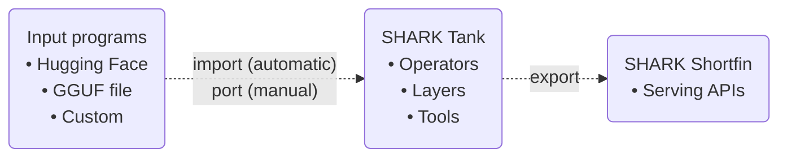
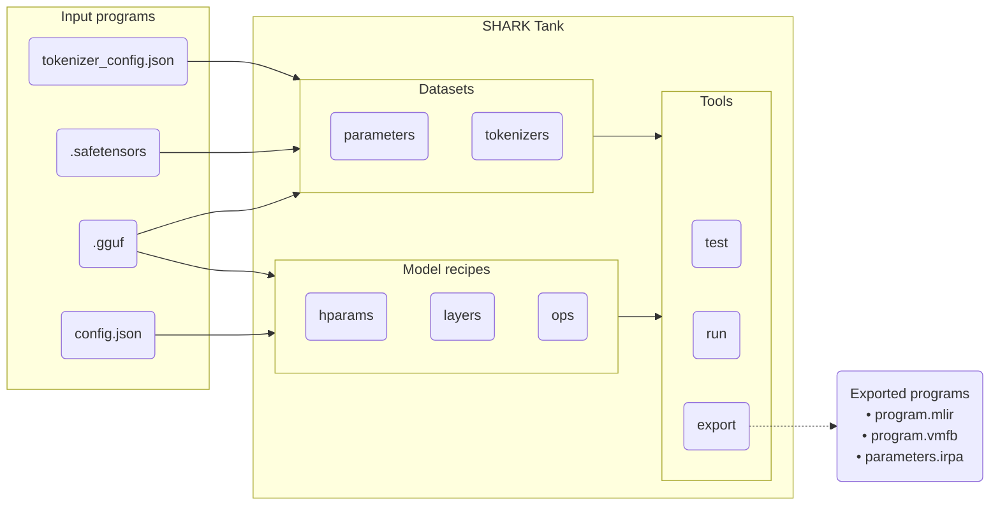

# Model cookbook

Note: These are early notes and commands that the sharktank team is using and
will turn into proper docs later.

## Diagrams

Overview:



Import process:



## Useful tools and projects

* https://huggingface.co/docs/huggingface_hub/en/guides/cli
* https://github.com/ggerganov/llama.cpp (specifically for [`convert_hf_to_gguf.py`](https://github.com/ggerganov/llama.cpp/blob/master/convert_hf_to_gguf.py))

## Create a quantized .irpa file

Some models on Hugging Face have GGUF files with mixed quantized types that
we do not currently support. For example,
https://huggingface.co/QuantFactory/Meta-Llama-3-8B-GGUF has a `q4_1` GGUF, however,
transcoding into IRPA using `sharktank.tools.dump_gguf` shows the output type
is `q6_k`, which is currently unimplemented.

To transcode a GGUF to IRPA in only `q4_1` we can use use the following commands
to quantize/transcode from the `f16` GGUF to `q4_1` IRPA:

```bash
~/llama.cpp/build/bin/quantize --pure /tmp/Meta-Llama-3-8B-f16.gguf /tmp/Meta-Llama-3-8B-q4_1.gguf Q4_1

python -m sharktank.tools.dump_gguf \
  --gguf-file=/tmp/Meta-Llama-3-8B-q4_1.gguf \
  --save /tmp/Meta-Llama-3-8B-q4_1.irpa
```

## Create a non-quantized .gguf file

Models on Hugging Face in the GGUF format are sometimes only uploaded with
certain quantized (e.g. 8 bit or lower) types. For example,
https://huggingface.co/SlyEcho/open_llama_3b_v2_gguf has these types:
`[f16, q4_0, q4_1, q5_0, q5_1, q8_0]`.

To convert our own Llama-3-8B F16 GGUF, we can find a source model (i.e.
safetensors or PyTorch) like https://huggingface.co/NousResearch/Meta-Llama-3-8B
and use the following commands:

```bash
huggingface-cli download --local-dir . NousResearch/Meta-Llama-3-8B

python ~/llama.cpp/convert_hf_to_gguf.py --outtype f16 --outfile Meta-Llama-3-8B-f16.gguf . --vocab-type bpe
```

Another example:

```bash
huggingface-cli login
huggingface-cli download --local-dir /tmp/mistral-7b mistralai/Mistral-7B-v0.1
python ~/llama.cpp/convert_hf_to_gguf.py --outtype f32 --outfile /tmp/mistral-7b-v0.1-f32.gguf /tmp/mistral-7b

# Run through reference implementation
python -m sharktank.examples.paged_llm_v1 \
  --gguf-file=/tmp/mistral-7b-v0.1-f32.gguf \
  --tokenizer-config-json=/tmp/mistral-7b/tokenizer_config.json \
  "Prompt"

# Export as MLIR
python -m sharktank.examples.export_paged_llm_v1 \
  --gguf-file=/tmp/mistral-7b-v0.1-f32.gguf \
  --output=/tmp/mistral-7b-v0.1-f32.mlir
```

See also the documentation at
https://github.com/ggerganov/llama.cpp?tab=readme-ov-file#prepare-and-quantize

## Using registered datasets with automatic file fetching

A number of GGUF datasets are coded directly in to the
[`hf_datasets.py`](/sharktank/sharktank/utils/hf_datasets.py) file. These can be
used with the `--hf-dataset=` flag, which will automatically fetch files using
[`hf_hub_download()`](https://huggingface.co/docs/huggingface_hub/en/guides/download).

* Note that the cache used by Hugging Face Hub can be
[customized](https://huggingface.co/docs/huggingface_hub/en/guides/manage-cache)
with the `HF_HOME` and `HF_HUB_CACHE` environment variables.

For example, to run the
[`paged_llm_v1`](/sharktank/sharktank/examples/paged_llm_v1.py) script with the
`open_llama_3b_v2_q8_0_gguf` dataset from
[SlyEcho/open_llama_3b_v2_gguf](https://huggingface.co/SlyEcho/open_llama_3b_v2_gguf):

```bash
python -m sharktank.examples.paged_llm_v1 --hf-dataset=open_llama_3b_v2_q8_0_gguf "Prompt 1"

open-llama-3b-v2-q8_0.gguf: 100%|█████████████████████████████| 3.64G/3.64G [01:35<00:00, 38.3MB/s]
tokenizer.model: 100%|███████████████████████████████████████████| 512k/512k [00:00<00:00, 128MB/s]
tokenizer_config.json: 100%|██████████████████████████████████████████████| 593/593 [00:00<?, ?B/s]
:: Prompting:
    b'Prompt 1'
:: Prompt tokens: tensor([[    1,  6874,   448, 29500, 29532,     0,     0,     0,     0,     0,
             0,     0,     0,     0,     0,     0]])
:: Invoke prefill:
```

## Walkthrough running a llama model

Setup (from [README.md](../README.md)):

* TODO: this could be replaced with `pip install iree-turbine` or
  `pip install sharktank` at some point. For now these are dev packages.

```bash
# Setup venv.
python -m venv --prompt sharktank .venv
source .venv/bin/activate

# Install requirements.
pip install -r pytorch-cpu-requirements.txt
pip install -f https://iree.dev/pip-release-links.html --src deps \
  -e "git+https://github.com/iree-org/iree-turbine.git#egg=iree-turbine"

# Install local projects.
pip install -r requirements.txt -e sharktank/ shortfin/
```

Download an input model:

* Common files are also available via `hf_datasets.py`.
  We can add other helpers too.

```bash
huggingface-cli login # if needed
huggingface-cli download --local-dir /tmp/open_llama_3b_v2 SlyEcho/open_llama_3b_v2_gguf open-llama-3b-v2-f16.gguf
```

Export to `.mlir` and `.json` files:

* TODO: mention `--bs` (batch size) arg and try through the rest of the pipeline
* TODO: test with other models (3B/7B/13B/70B, llama3, Mistral, etc.)

```bash
python -m sharktank.examples.export_paged_llm_v1 \
  --gguf-file=/tmp/open_llama_3b_v2/open-llama-3b-v2-f16.gguf \
  --output-mlir=/tmp/open_llama_3b_v2/open-llama-3b-v2-f16.mlir \
  --output-config=/tmp/open_llama_3b_v2/open-llama-3b-v2-f16.json
```

Compile using flags of your choosing, e.g. for `llvm-cpu`:

* TODO: test on Vulkan, ROCm, etc.

```bash
iree-compile /tmp/open_llama_3b_v2/open-llama-3b-v2-f16.mlir \
  --iree-hal-target-backends=llvm-cpu \
  --iree-llvmcpu-target-cpu-features=host \
  -o /tmp/open_llama_3b_v2/open-llama-3b-v2-f16_cpu.vmfb
```

Run via `service_v1_cli.py` (shortfin serving, with tokenizer):

* TODO: script (via service CLI?) to dump inputs/outputs to .bin/.npy files

```bash
python -m shortfin.llm.impl.service_v1_cli \
  --tokenizer=openlm-research/open_llama_3b_v2 \
  --config=/tmp/open_llama_3b_v2/open-llama-3b-v2-f16.json \
  --vmfb=/tmp/open_llama_3b_v2/open-llama-3b-v2-f16_cpu.vmfb \
  --gguf=/tmp/open_llama_3b_v2/open-llama-3b-v2-f16.gguf
```

Run via `iree-run-module` (low level tool, for debugging/profiling):

* TODO: Use real inputs/outputs dumped from Python here

```bash
# Prefill
iree-run-module \
  --module=/tmp/open_llama_3b_v2/open-llama-3b-v2-f16_cpu.vmfb \
  --function=prefill_bs4 \
  --device=local-task \
  --input=4x1xi64=0 \
  --input=4xi64=1 \
  --input=4x1xi64=0,1,2,3 \
  --input=1x2662400xf16 \
  --parameters=model=/tmp/open_llama_3b_v2/open-llama-3b-v2-f16.gguf

# Decode
# TODO(scotttodd): use other inputs here, this crashes x_x (service CLI works though)
iree-run-module \
  --module=/tmp/open_llama_3b_v2/open-llama-3b-v2-f16_cpu.vmfb \
  --function=decode_bs4 \
  --device=local-task \
  --input=4x1xi64=0 \
  --input=4xi64=1 \
  --input=4xi64=1 \
  --input=4x1xi64=0,1,2,3 \
  --input=1x2662400xf16 \
  --parameters=model=/tmp/open_llama_3b_v2/open-llama-3b-v2-f16.gguf
```

## Generating data for llama models

```bash
set TURBINE_DEBUG=log_level=info
python -m sharktank.models.llama.tools.generate_data \
  --tokenizer=openlm-research/open_llama_3b_v2 \
  --config=/tmp/open_llama_3b_v2/open-llama-3b-v2-f16.json \
  --output-dir=/tmp/open_llama_3b_v2/inputs \
  --prompt="What is the meaning of life?"
```
